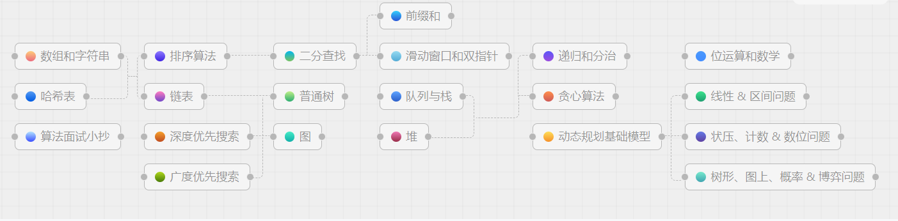

# Leetcode-Top200
-----
## 题单

| No.    |  Title  |  Solution  |  Difficulty |
|--------|---------|--------|--------|
|0001|Two Sum|[两数之和](https://github.com/MRcyf2/Leetcode-Top200/blob/main/no.1%E4%B8%A4%E6%95%B0%E4%B9%8B%E5%92%8C.py) |Easy|
|0002|Add Two Numbers|none|Medium|
|0003|Longest Substring Without Repeating Characters|none|Medium|
|0004|Median of Two Sorted Arrays|none|Hard|
|0005|Longest Palindromic Substring|none|Medium|
|0006|Zigzag Conversion|none|Medium|
|0007|Reverse Integer|none|Medium|
|0008|String to Integer (atoi)|none|Medium|
|0009|Palindrome Number|none|Easy|
|0010|Regular Expression Matching|none|Hard|
|0011|Container With Most Water|none|Medium|
|0012|Integer to Roman|none|Medium|
|0013|Roman to Integer|none|Easy|
|0014|Longest Common Prefix|none|Easy|
|0015|3Sum|none|Medium|
|0016|3Sum Closest|none|Medium|
|0017|Letter Combinations of a Phone Number|none|Medium|
|0018|4Sum|none|Medium|
|0019|Remove Nth Node From End of List|none|Medium|
|0020|Valid Parentheses|none|Easy|
|0021|Merge Two Sorted Lists|none|Easy|
|0022|Generate Parentheses|none|Medium|
|0023|Merge k Sorted Lists|none|Hard|
|0024|Swap Nodes in Pairs|none|Medium|
|0025|Reverse Nodes in k-Group|none|Hard|
|0026|Remove Duplicates from Sorted Array|none|Easy|
|0027|Remove Element|none|Easy|
|0028|Find the Index of the First Occurrence in a String|none|Medium|
|0029|Divide Two Integers|none|Medium|
|0030|Substring with Concatenation of All Words|none|Hard|
|0031|Next Permutation|none|Medium|
|0032|Longest Valid Parentheses|none|Hard|
|0033|Search in Rotated Sorted Array|none|Medium|
|0034|Find First and Last Position of Element in Sorted Array|none|Medium|
|0035|Search Insert Position|none|Easy|
|0036|Valid Sudoku|none|Medium|
|0037|Sudoku Solver|none|Hard|
|0038|Count and Say|none|Medium|
|0039|Combination Sum|none|Medium|
|0040|Combination Sum II|none|Medium|
|0041|First Missing Positive|none|Hard|
|0042|Trapping Rain Water|none|Hard|
|0043|Multiply Strings|none|Medium|
|0044|Wildcard Matching|none|Hard|
|0045|Jump Game II|none|Medium|
|0046|Permutations|none|Medium|
|0047|Permutations II|none|Medium|
|0048|Rotate Image|none|Medium|
|0049|Group Anagrams|none|Medium|
|0050|Pow(x, n)|none|Medium|
|0051|N-Queens|none|Hard|
|0052|N-Queens II|none|Hard|
|0053|Maximum Subarray|none|Medium|
|0054|Spiral Matrix|none|Medium|
|0055|Jump Game|none|Medium|
|0056|Merge Intervals|none|Medium|
|0057|Insert Interval|none|Medium|
|0058|Length of Last Word|none|Easy|
|0059|Spiral Matrix II|none|Medium|
|0060|Permutation Sequence|none|Hard|
|0061|Rotate List|none|Medium|
|0062|Unique Paths|none|Medium|
|0063|Unique Paths II|none|Medium|
|0064|Minimum Path Sum|none|Medium|
|0065|Valid Number|none|Hard|
|0066|Plus One|none|Easy|
|0067|Add Binary|none|Easy|
|0068|Text Justification|none|Hard|
|0069|Sqrt(x)|none|Easy|
|0070|Climbing Stairs|none|Easy|
|0071|Simplify Path|none|Medium|
|0072|Edit Distance|none|Hard|
|0073|Set Matrix Zeroes|none|Medium|
|0074|Search a 2D Matrix|none|Medium|
|0075|Sort Colors|none|Medium|
|0076|Minimum Window Substring|none|Hard|
|0077|Combinations|none|Medium|
|0078|Subsets|none|Medium|
|0079|Word Search|none|Medium|
|0080|Remove Duplicates from Sorted Array II|none|Medium|
|0081|Search in Rotated Sorted Array II|none|Medium|
|0082|Remove Duplicates from Sorted List II|none|Medium|
|0083|Remove Duplicates from Sorted List|none|Easy|
|0084|Largest Rectangle in Histogram|none|Hard|
|0085|Maximal Rectangle|none|Hard|
|0086|Partition List|none|Medium|
|0087|Scramble String|Hard|
|0088|Merge Sorted Array|none|Easy|
|0089|Gray Code|none|Medium|
|0090|Subsets II|none|Medium|
|0091|Decode Ways|none|Medium|
|0092|Reverse Linked List II|none|Medium|
|0093|Restore IP Addresses|none|Medium|
|0094|Binary Tree Inorder Traversal|none|Easy|
|0095|Unique Binary Search Trees II|none|Medium|
|0096|Unique Binary Search Trees|none|Medium|
|0097|Interleaving String|none|Medium|
|0098|Validate Binary Search Tree|none|Medium|
|0099|Recover Binary Search Tree|none|Medium|
|0100|Same Tree|none|Easy|
|0101|Symmetric Tree|none|Easy|
|0102|Binary Tree Level Order Traversal|none|Medium|
|0103|Binary Tree Zigzag Level Order Traversal|none|Medium|
|0104|Maximum Depth of Binary Tree|none|Easy|
|0105|Construct Binary Tree from Preorder and Inorder Traversal|none|Medium|
|0106|Construct Binary Tree from Inorder and Postorder Traversal|none|Medium|
|0107|Binary Tree Level Order Traversal II|none|Medium|
|0108|Convert Sorted Array to Binary Search Tree|none|Easy|
|0109|Convert Sorted List to Binary Search Tree|none|Medium|
|0110|Balanced Binary Tree|none|Easy|
|0111|Minimum Depth of Binary Tree|none|Easy|
|0112|Path Sum|none|Easy|
|0113|Path Sum II|none|Medium|
|0114|Flatten Binary Tree to Linked List|none|Medium|
|0115|Distinct Subsequences|none|Hard|
|0116|Populating Next Right Pointers in Each Node|none|Medium|
|0117|Populating Next Right Pointers in Each Node II|none|Medium|
|0118|Pascal's Triangle|none|Easy|
|0119|Pascal's Triangle II|none|Easy|
|0120|Triangle|none|Medium|
|0121|Best Time to Buy and Sell Stock|none|Easy|
|0122|Best Time to Buy and Sell Stock II|none|Medium|
|0123|Best Time to Buy and Sell Stock III|none|Hard|
|0124|Binary Tree Maximum Path Sum|none|Hard|
|0125|Valid Palindrome|none|Easy|
|0126|Word Ladder II|none|Hard|
|0127|Word Ladder|none|Hard|
|0128|Longest Consecutive Sequence|none|Medium|
|0129|Sum Root to Leaf Numbers|none|Medium|
|0130|Surrounded Regions|none|Medium|
|0131|Palindrome Partitioning|none|Medium|
|0132|Palindrome Partitioning II|none|Hard|
|0133|Clone Graph|none|Medium|
|0134|Gas Station|none|Medium|
|0135|Candy|none|Hard|
|0136|Single Number|none|Easy|
|0137|Single Number II|none|Medium|
|0138|Copy List with Random Pointer|none|Medium|
|0139|Word Break|none|Medium|
|0140|Word Break II|none|Hard|
|0141|Linked List Cycle|none|Easy|
|0142|Linked List Cycle II|none|Medium|
|0143|Reorder List|none|Medium|
|0144|Binary Tree Preorder Traversal|none|Easy|
|0145|Binary Tree Postorder Traversal|none|Easy|
|0146|LRU Cache|none|Medium|
|0147|Insertion Sort List|none|Medium|
|0148|Sort List|none|Medium|
|0149|Max Points on a Line|none|Hard|
|0150|Evaluate Reverse Polish Notation|none|Medium|
|0151|Reverse Words in a String|none|Medium|
|0152|Maximum Product Subarray|none|Medium|
|0153|Find Minimum in Rotated Sorted Array|none|Medium|
|0154|Find Minimum in Rotated Sorted Array II|none|Hard|
|0155|Min Stack|none|Medium|
|0156|Binary Tree Upside Down|none|Medium|
|0157|Read N Characters Given Read4|none|Easy|
|0158|Read N Characters Given read4 II - Call Multiple Times|none|Hard|
|0159|Longest Substring with At Most Two Distinct Characters|none|Medium|
|0160|Intersection of Two Linked Lists|none|Easy|
|0161|One Edit Distance|none|Medium|
|0162|Find Peak Element|none|Medium|
|0163|Missing Ranges|none|Easy|
|0164|Maximum Gap|none|Hard|
|0165|Compare Version Numbers|none|Medium|
|0166|Fraction to Recurring Decimal|none|Medium|
|0167|Two Sum II - Input Array Is Sorted|none|Medium|
|0168|Excel Sheet Column Title|none|Easy|
|0169|Majority Element|none|Easy|
|0170|Two Sum III - Data structure design|none|Easy|
|0171|Excel Sheet Column Number|none|Easy|
|0172|Factorial Trailing Zeroes|none|Medium|
|0173|Binary Search Tree Iterator|none|Medium|
|0174|Dungeon Game|none|Hard|
|0175|Combine Two Tables|none|Easy|
|0176|Second Highest Salary|none|Medium|
|0177|Nth Highest Salary|none|Medium|
|0178|Rank Scores|none|Medium|
|0179|Largest Number|none|Medium|
|0180|Consecutive Numbers|none|Medium|
|0181|Employees Earning More Than Their Managers|none|Easy|
|0182|Duplicate Emails|none|Easy|
|0183|Customers Who Never Order|none|Easy|
|0184|Department Highest Salary|none|Medium|
|0185|Department Top Three Salaries|none|Hard|
|0186|Reverse Words in a String II|none|Medium|
|0187|Repeated DNA Sequences|none|Medium|
|0188|Best Time to Buy and Sell Stock IV|none|Hard|
|0189|Rotate Array|none|Medium|
|0190|Reverse Bits|none|Easy|
|0191|Number of 1 Bits|none|Easy|
|0192|Word Frequency|none|Medium|
|0193|Valid Phone Numbers|none|Easy|
|0194|Transpose File|none|Medium|
|0195|Tenth Line|none|Easy|
|0196|Delete Duplicate Emails|none|Easy|
|0197|Rising Temperature|none|Easy|
|0198|House Robber|none|Medium|
|0199|Binary Tree Right Side View|none|Medium|
|0200|Number of Islands|none|Medium|

-----
___参考学习路线___
